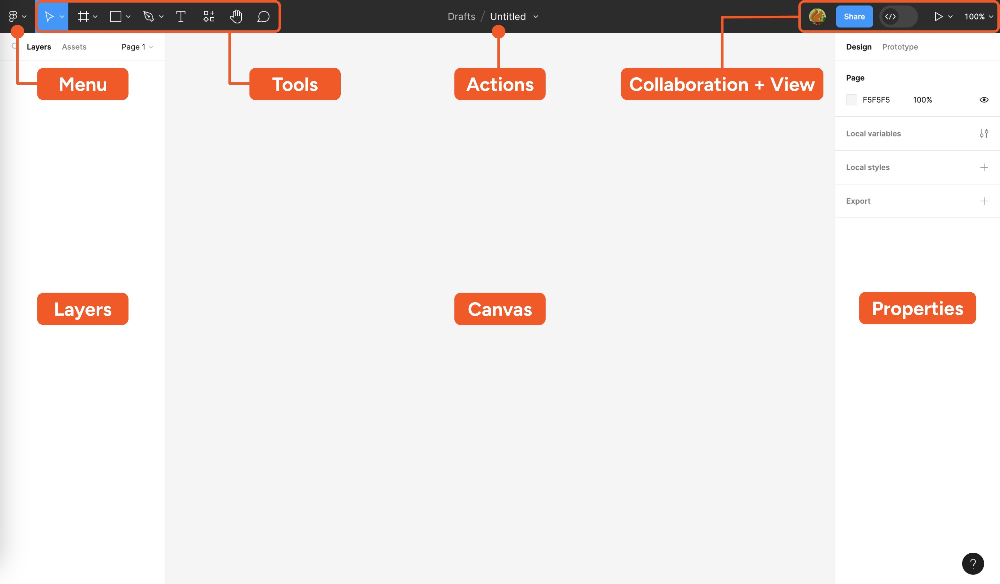

Canvas : The area where you’ll create all of your designs

&nbsp;

&nbsp;

* To create new layout, we have to click on *Design file*

* Change Name = > Actions section

* **Tools** section is divided into the following parts
  * Move tool
  * Region tools
  * Shape tools
  * Creation tools
  * Text
  * Resources
  * Hand tool
  * Add comment
  
&nbsp;

&nbsp;

## Move tool

Using move tool we can move anything in camvas.

&nbsp;

## Region tools

Region tools are divided into 3 parts.

* Frame
* Section
* Slice

### <u>Frame</u>
In frames we can select any kind of frame like any shape of phone, tablet, desktop, social media etc.

We can change the name of frame from left sidebar.

### <u>Section</u>
We can also add sections from frames section.

### <u>Slice</u>

If we want to share a small part of a design we use slice.

&nbsp;

&nbsp;

## Shape tools

Shape tools are divided into -

* Rectangle
* Line
* Arrow
* Ellipse
* Polygon
* Star
* Place images or videos

We can change the dimension, border radius, color etc from right sidebar.

&nbsp;

&nbsp;

## Creation tools

Creation tools are divided into -

* Pen
* Pencil

&nbsp;
&nbsp;

&nbsp;